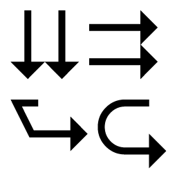
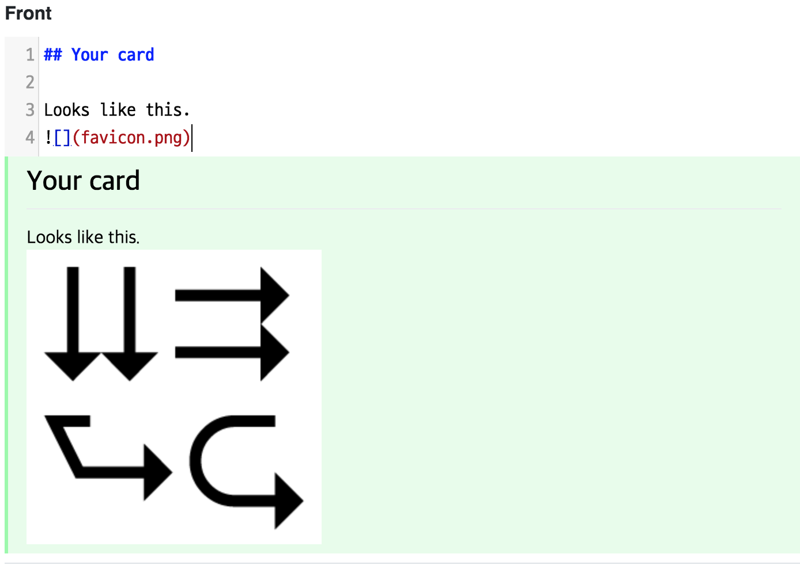
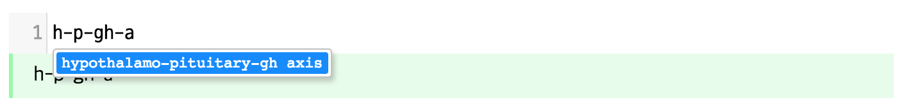
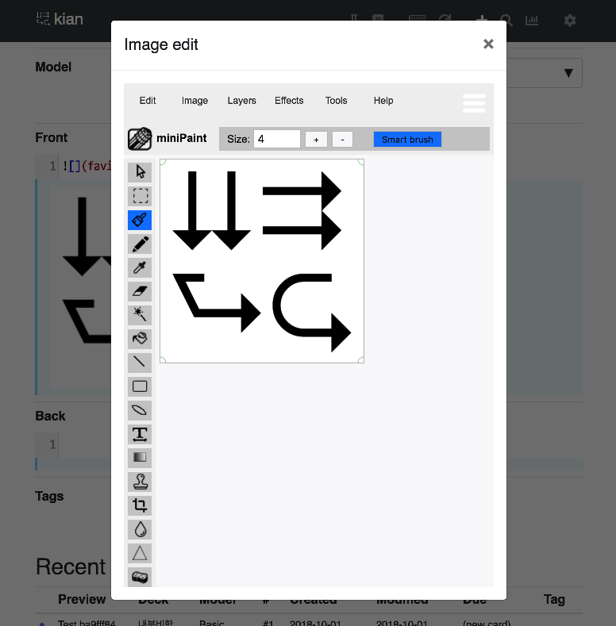
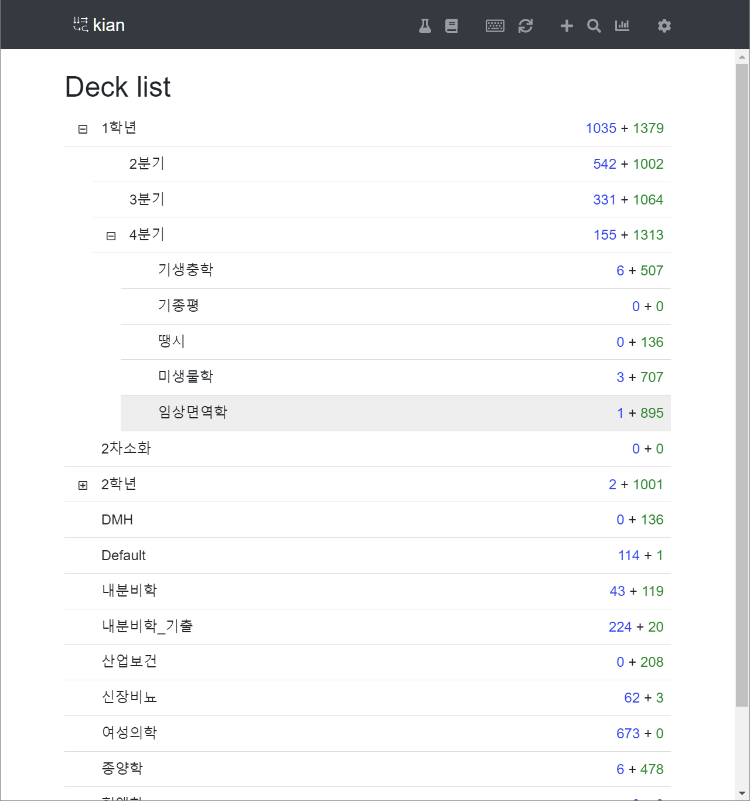
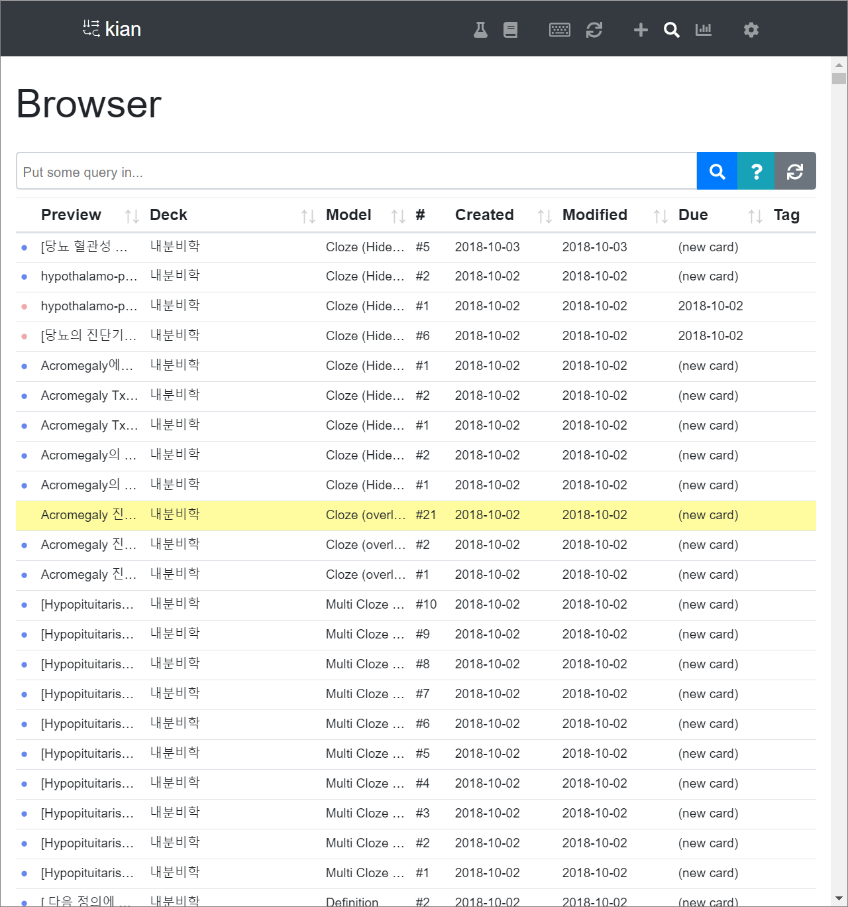
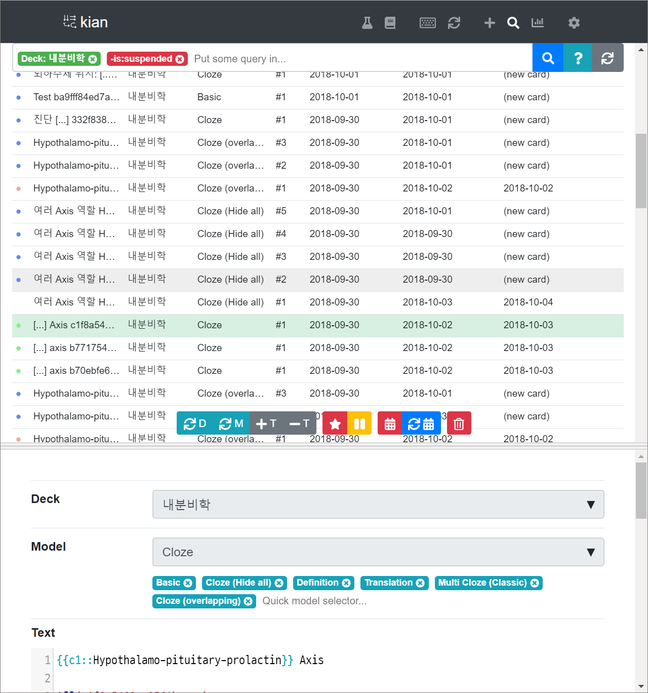
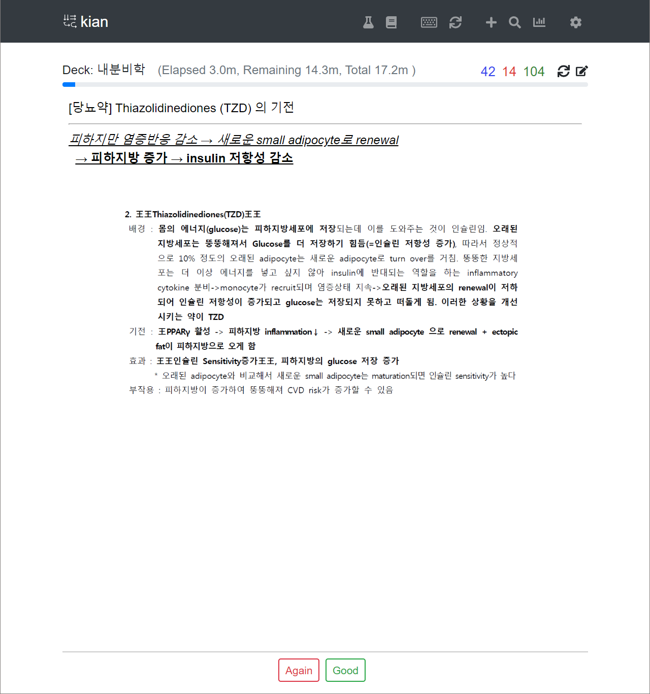
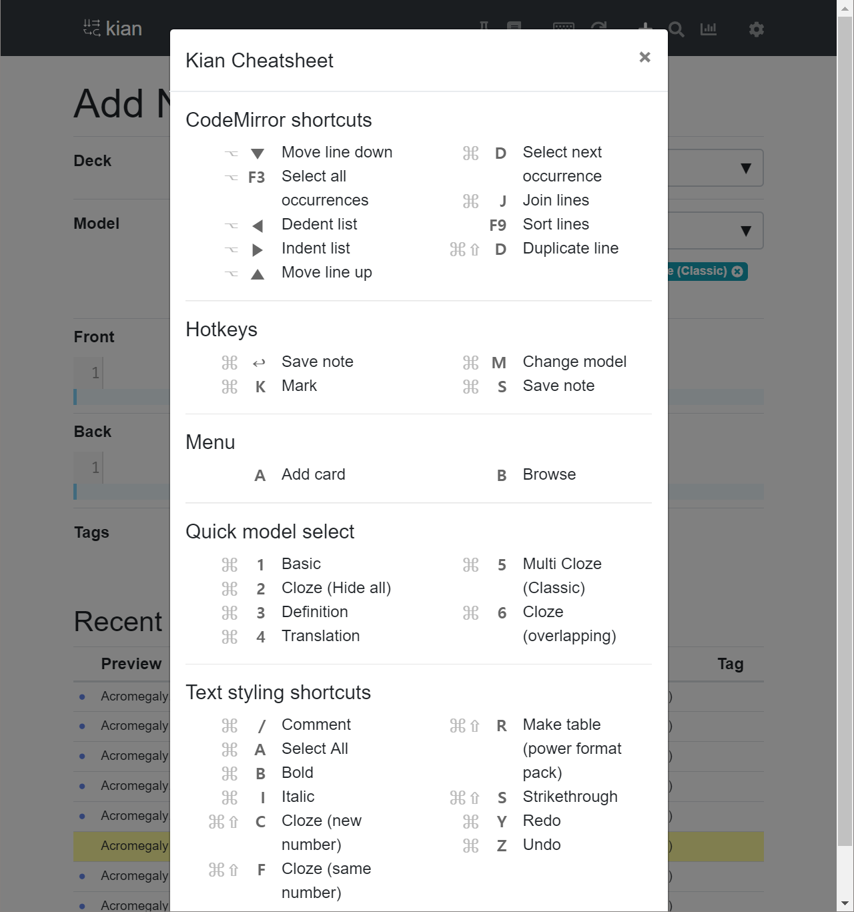

# kian

<p align="center">

</p>

> Work in progress. Lots of functionalities missing!

kian is an alternative frontend for [Anki](https://apps.ankiweb.net/). It tries to be a **very opinionated** frontend. You'll configure less, and spend your time doing more Anki. Some of the features rae:

- Markdown editor for everything. Make structured notes faster with markdown. You can edit your old plain-html cards using [WYSIWYG editor (summernote)](https://summernote.org/) though, but most of kian's functionality is built for markdown mode only.


- **Word autocomplete** based on your existing notes. 

- Image-editor embedded ([MiniPaint](https://github.com/viliusle/miniPaint))

- Browser right below the add card window. I know you need it.
- Better designed everything. (In my sense.)

## Building

You need to have [Node.js](https://nodejs.org/) and [Python 3](https://python.org) installed. Clone the repository and install the dependencies.

```
$ npm install  // Install node.js dependencies
$ pip3 install -r backend/requirements.txt  // Install python3 dependencies
```

To run the development server, you'll need an Anki2 database file at `backend/testdata`. Copy one from your existing Anki installation so that `collection.anki2` goes to `backend/testdata/collection.anki2`, with all media files.

> Right now kian cannot create an empty collection. Not yet implemented. So you should start with your existing collection.

After you've done that, you can start the development server.

```
$ npm start
```
## Gallary

This reflects the version as of 2018-10-03. UI may change drastically as the program is developed.

- Deck overview (Home page) 
- Card browser 
- Card browser w/ some card selected & browser toolbox opened 
- Study mode 
- Hotkey helper 


## License

This project is licensed under AGPL.


## Vue-cli 3 commands

```
## Project setup
npm install

### Compiles and hot-reloads for development
npm run serve

### Compiles and minifies for production
npm run build

### Run your tests
npm run test

### Lints and fixes files
npm run lint

### Run your unit tests
npm run test:unit
```
